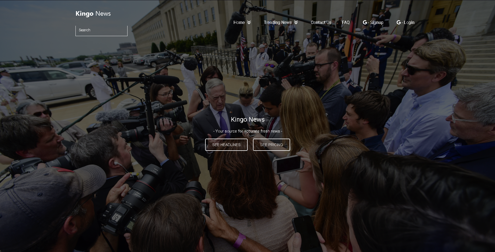
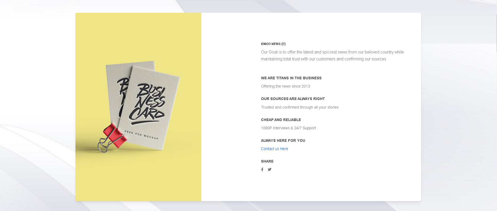
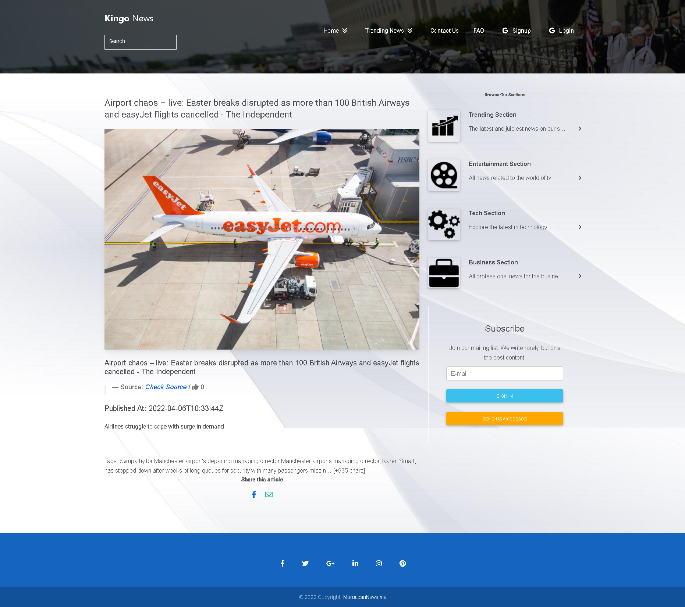
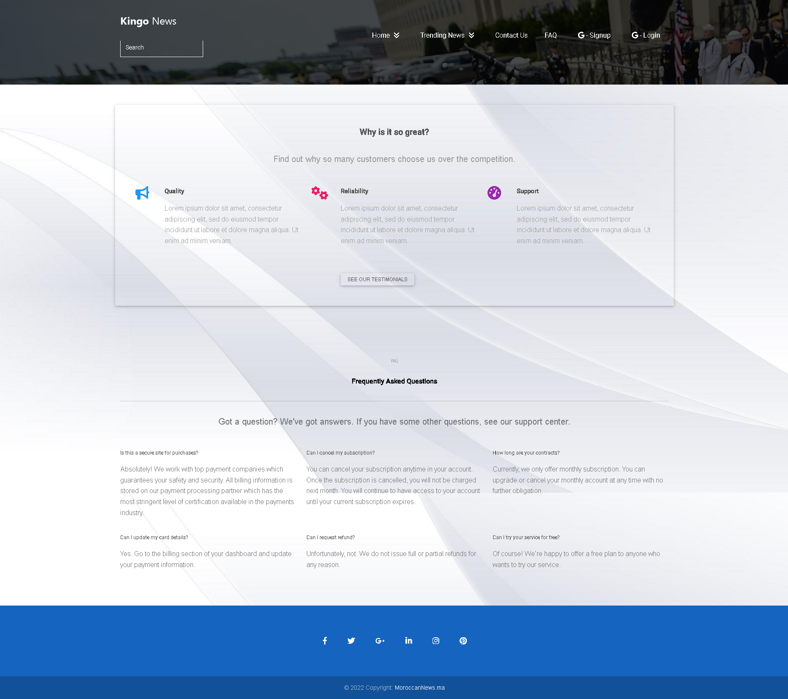
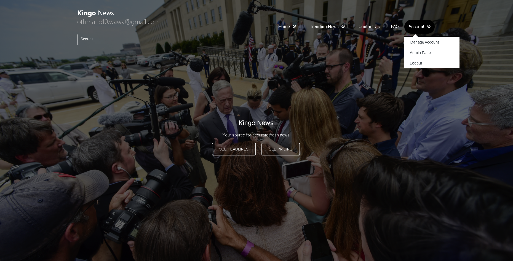
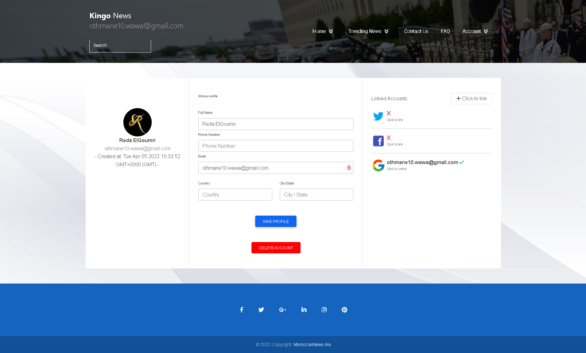
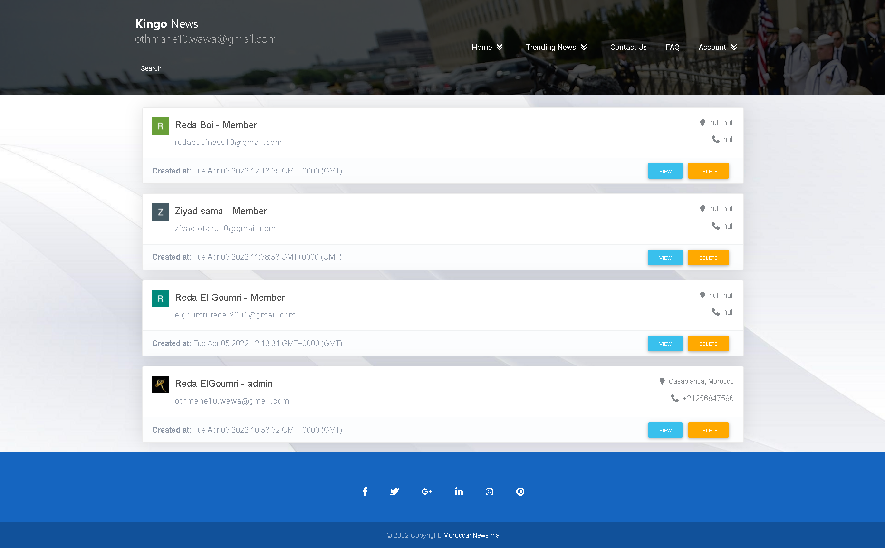

# King'o News

Lisez tous les articles récents sur les drames et les actualités de votre choix via NewsAPI


## Features

- Système d'authentification Google
- utilisateur C.R.U.D 
- liste des articles d'actualité récents
- liste des articles de presse par catégorie
- lire tous les détails de l'article
- rechercher un article de votre choix
- formulaire de contact : envoyez-nous un message si vous rencontrez un problème
- manipulation complète du NewsAPI


## Screenshots











## Tech

**Client:** Angular, Bootstrap, Firebase

**API:** NewsAPI, FormSubmit


## Référence API (NewsAPI)

#### Get top headlines of a country

```http
  GET https://newsapi.org/v2/top-headlines?country=PAYS&apiKey=api_key
```

| Parameter | Type     | Description                |
| :-------- | :------- | :------------------------- |
| `api_key` | `string` | **Required**. Ton Key API |
| `PAYS` | `string` | The 2-letter ISO 3166-1 code of the country you want to get headlines for. Note: you can't mix this param with the sources param. |
| `category` | `string` | The category you want to get headlines for. Note: you can't mix this param with the sources param.|
|  | | Possible options: business, entertainment, general, health, science, sports, technology.   |
| `sources` | `string` | A comma-seperated string of identifiers for the news sources or blogs you want headlines from. Use the /top-headlines/sources endpoint to |
|  | | locate these programmatically or look at the sources index. Note: you can't mix this param with the country or category params.  |
| `pageSize` | `int` | The number of results to return per page (request). 20 is the default, 100 is the maximum. |
| `page` | `int` | Use this to page through the results if the total results found is greater than the page size. |

#### search for an article

```http
  GET https://newsapi.org/v2/everything?q=SEARCH&apiKey=api_key
```

| Parameter | Type     | Description                       |
| :-------- | :------- | :-------------------------------- |
| `api_key` | `string` | **Required**. Ton Key API |
| `q`      | `string` | Keywords or phrases to search for in the article title and body. |


## Référence des Couleurs

| Color             | Hex                                                                |
| ----------------- | ------------------------------------------------------------------ |
| Footer Blue |  #0d6efd |
| Danger |  #f93154 |
| Primary |  #1266f1 |
| Warning |  #ffa900 |


## Exécuter Localement

Clone le projet

```bash
  git clone https://github.com/RedaBoi12/kingo-news/tree/kingo
```

Aller dans le répertoire du projet

```bash
  cd kingo-news-kingo
```

Installer les dépendances

```bash
  npm install
```

Démarrer le serveur d'Angular CLI

```bash
  ng serve
```


## Bibliothèques NPM

- Angular CLI
- Angular Material
- Angular Fire
- Bootstrap MD
- Bootstrap
- Firebase
- Firebase Tools
- FortAwesome
- rxjs


## FAQ

#### Combien de temps ce projet vous a-t-il pris ?

Environ un mois et toujours en développement

#### Comment puis-je tester ce projet localement ?

Veuillez vous référer à la section "Exécuter localement" pour afficher un guide étape par étape

#### Pourquoi avez-vous décidé de créer un site Web d'actualités comme premier projet ?


j'ai toujours voulu créer un site Web d'actualités pour tester pleinement mon potentiel dans un cadre  
et j'ai trouvé l'API News qui m'a évité de rechercher et de télécharger personnellement des articles  
d'actualité et de les enregistrer localement


## Roadmap

- Additional browser support

- Système du Like des articles

- Système des Commentaires d'articles

- Abonnements payants


## Feedback

Si vous avez des commentaires, veuillez me contacter à redabusiness10@gmail.com


## Créateur

- [@ElGoumri Reda](https://www.github.com/RedaBoi12)


## Gestion des Versions

- **v0.1:** Création des vues principales
- **v0.15:** Remodelé et fini toutes les vues
- **v0.2:** Ajout de la première implémentation de newsAPI
- **v0.3:** Ajout de la première implémentation du système de connexion par e-mail et mot de passe
- **v0.4:** Ajout de la manipulation complète de NewsAPI avec les catégories et les détails de l'article
- **v0.5:** Basculement vers le système d'authentification Google pour avoir Access a l'API Google Contacts
- **v1.0:** 
    * Ajout d'une nouvelle possibilité de recherche API pour rechercher n'importe quel article dans la base de données
    - Ajout du formulaire de contact utilisant le service de soumission de formulaire
    - Ajout de la gestion complète du profil, y compris l'édition détaillée et la suppression du compte
    - Ajout d'un panneau d'administration auquel seuls les utilisateurs ayant un rang d'administrateur ont accès
    - Ajout du CRUD des utilisateurs complets dans le panneau d'administration
    - Passé à la version 1.0 car d'autres mises à jour mineures ont été ajoutées et jamais mentionnées
    
    
    
    
## 🚀 A propos du createur

Bonjour, je m'appelle ElGoumri Reda, et je suis le créateur du site Web  
"The King of News (King'o News)", c'est mon premier projet angulaire et  
est principalement destiné à m'aider à apprendre et à comprendre le framework  
autant que possible .


## 🛠 Compétences
HTML, CSS, jQuery ,Javascript, Typescript
Frameworks: Bootstrap, Angular


## Leçons apprises

Bien avant ce projet, j'avais très peu de connaissances sur le développement front end  
ou le développement Web en général, mais travailler sur ce projet, obtenir des erreurs  
et passer autant de temps à chercher des correctifs est vraiment la façon dont une personne  
apprend quelque chose.  

Le défi le plus difficile pour moi dans ce projet a été d'apprendre à manipuler complètement  
une API à l'aide des requêtes http et du module HttpClient proposé par Angular, que ce soit en  
récupérant toutes les informations via une requête GET, en chargeant le retour en un observable,  
en le transformant en un array pour le déplacer d'une page à l'autre et afficher les informations  
correctes à l'utilisateur. Ce fut un bon moment d'apprentissage.

